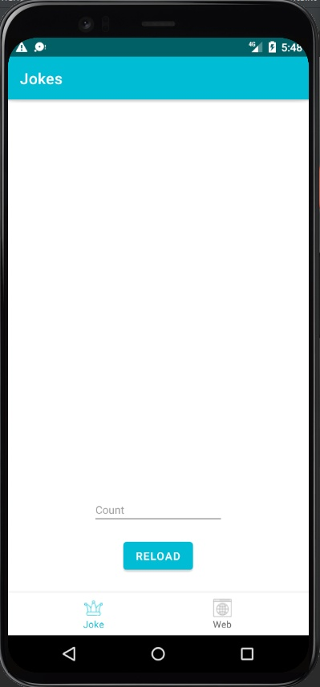
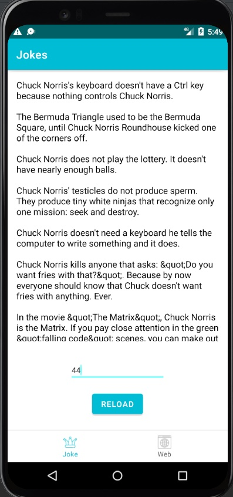
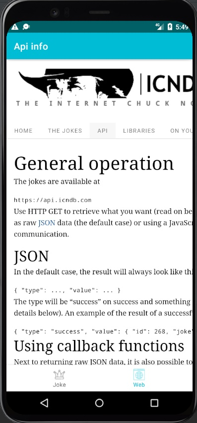

### Данный проект содержит исходный код приложения с шутками про Чака Норриса

### Характеристики приложения:
Приложение написано на языке Kotlin для платформы Android версии API не ниже 21 (Android 5.0).

### Работа с приложением:

Приложение состоит из друх экранов. Первый экран представляет собой экраз загрузки шуток, при запуске приложения оно выглядит следуюшим образом:

Для того чтобы загрузить шутки, необходимо ввести нужное количество а поле "Count" и нажать кнопку "Reload", результат:

Второй экран представляет собой браузер с загруженной ссылкой. В котором представленна информация по использованному API:

